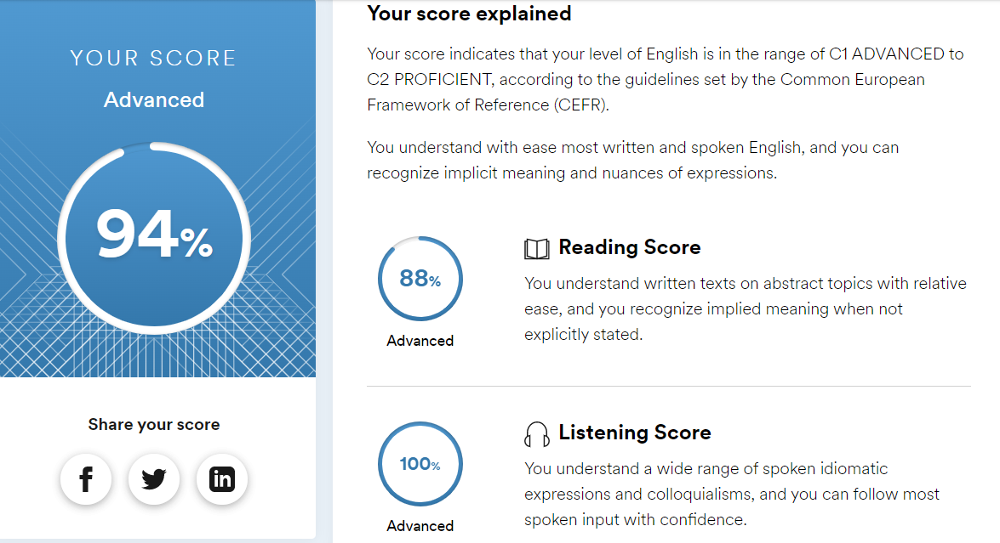

## 2025Q2-rsschool-cv
---
# Natallia Patsiomkina
### Contact Info:
+ **Phone:** +375 29 384-28-65
+ **E-mail:** patsiomkina@inbox.ru
+ **GitHub:** patsiomkina


---
### Briefly About Myself:
I’m interested in Web Development because this occupation provides endless possibilities for professional growth, besides there’s a huge amount of free high quality resources for self-education and a large community of developers.


---
### Skills and Proficiency:
+ Python
+ Git, GitHub
+ SQL


---
### Code example:
**Isograms from CODEWARS:** _An isogram is a word that has no repeating letters, consecutive or non-consecutive. Implement a function that determines whether a string that contains only letters is an isogram. Assume the empty string is an isogram. Ignore letter case._
```
def is_isogram(string):
    new_str = ''
    for letter in string:
        new_str += letter
    new_set = set(new_str.lower())
    finish = ''.join(sorted(new_set))
    start = ''.join(sorted(string.lower()))
    if start == finish or string == '':
        return True
    else:
        return False
```


---
### Education:
**University:** Francisk Skorina Gomel State University, Criminal Law and Procedure Major


---
### Courses:
+ FreeCodeCamp
+ HTML Academy


---
### Languages:
+ **English** - Advanced (according to the online test at www.efset.org)

+ **Russian** - Native


---